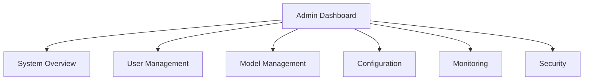

# Admin Dashboard Documentation

## Version Information
- **Document Version**: 1.0.0
- **Last Updated**: April 17, 2024
- **Compatible System Version**: 1.0.0

## Related Documentation
- [Security Documentation](security-documentation.md) - For authentication, authorization, and security settings
- [Data Strategy](data-strategy.md) - For data management and analytics features
- [System Architecture](system-architecture.md) - For system overview and component interactions
- [Shared Components](shared-components.md) - For common utilities and components

## Table of Contents
1. [Overview](#overview)
2. [Access Control](#access-control)
3. [Dashboard Features](#dashboard-features)
4. [System Monitoring](#system-monitoring)
5. [User Management](#user-management)
6. [Model Management](#model-management)
7. [Configuration](#configuration)
8. [Security](#security)

## Overview

### Dashboard Layout


### Access Levels
| Role | Permissions |
|------|-------------|
| Super Admin | Full system access |
| Admin | User and model management |
| Operator | Monitoring and basic configuration |
| Viewer | Read-only access |

## Access Control
For implementation details of access control components, see [Shared Components - Access Control](#access-control)

### Authentication
For detailed security implementation, see [Security Documentation - Authentication](#authentication)

```python
# Admin authentication
class AdminAuth:
    def authenticate_admin(self, credentials: Dict) -> bool:
        return (
            self.validate_credentials(credentials) and
            self.check_2fa(credentials) and
            self.verify_ip(credentials)
        )

    def validate_credentials(self, credentials: Dict) -> bool:
        return self.db.validate_admin(
            credentials['username'],
            credentials['password']
        )
```

### Authorization
```python
# Admin authorization
class AdminAuthorization:
    def check_permissions(self, admin: Admin, resource: str) -> bool:
        return (
            self.verify_role(admin.role) and
            self.check_resource_access(admin, resource) and
            self.validate_session(admin.session)
        )
```

## Dashboard Features

### System Overview
```python
# System overview
class SystemOverview:
    def get_system_status(self) -> Dict:
        return {
            'api_status': self.check_api_health(),
            'model_status': self.check_model_health(),
            'database_status': self.check_database_health(),
            'queue_status': self.check_queue_health()
        }

    def get_system_metrics(self) -> Dict:
        return {
            'cpu_usage': self.get_cpu_usage(),
            'memory_usage': self.get_memory_usage(),
            'disk_usage': self.get_disk_usage(),
            'network_usage': self.get_network_usage()
        }
```

### User Management
```python
# User management
class UserManager:
    def create_user(self, user_data: Dict) -> User:
        return self.db.create_user({
            'username': user_data['username'],
            'role': user_data['role'],
            'permissions': user_data['permissions']
        })

    def update_user(self, user_id: str, updates: Dict) -> User:
        return self.db.update_user(user_id, updates)

    def delete_user(self, user_id: str) -> bool:
        return self.db.delete_user(user_id)
```

## System Monitoring
For metrics collection and alert management, see [Shared Components - Monitoring Components](#monitoring-components)

### Real-time Monitoring
```python
# Real-time monitoring
class SystemMonitor:
    def monitor_system(self) -> Dict:
        return {
            'api_metrics': self.get_api_metrics(),
            'model_metrics': self.get_model_metrics(),
            'system_metrics': self.get_system_metrics(),
            'alert_status': self.get_alert_status()
        }

    def get_api_metrics(self) -> Dict:
        return {
            'requests_per_second': self.get_request_rate(),
            'average_latency': self.get_average_latency(),
            'error_rate': self.get_error_rate()
        }
```

### Alert Management
```python
# Alert management
class AlertManager:
    def get_alerts(self) -> List[Dict]:
        return self.db.get_alerts()

    def acknowledge_alert(self, alert_id: str) -> bool:
        return self.db.update_alert(alert_id, {'status': 'acknowledged'})

    def resolve_alert(self, alert_id: str) -> bool:
        return self.db.update_alert(alert_id, {'status': 'resolved'})
```

## User Management

### User Operations
```python
# User operations
class UserOperations:
    def list_users(self) -> List[User]:
        return self.db.get_all_users()

    def search_users(self, query: str) -> List[User]:
        return self.db.search_users(query)

    def get_user_details(self, user_id: str) -> Dict:
        return self.db.get_user_details(user_id)
```

### Role Management
```python
# Role management
class RoleManager:
    def create_role(self, role_data: Dict) -> Role:
        return self.db.create_role(role_data)

    def update_role(self, role_id: str, updates: Dict) -> Role:
        return self.db.update_role(role_id, updates)

    def delete_role(self, role_id: str) -> bool:
        return self.db.delete_role(role_id)
```

## Model Management
For comprehensive model security and deployment, refer to [Security Documentation - Model Security](#model-security)

### Model Operations
```python
# Model operations
class ModelManager:
    def list_models(self) -> List[Model]:
        return self.db.get_all_models()

    def get_model_details(self, model_id: str) -> Dict:
        return self.db.get_model_details(model_id)

    def update_model(self, model_id: str, updates: Dict) -> Model:
        return self.db.update_model(model_id, updates)
```

### Model Deployment
```python
# Model deployment
class ModelDeployer:
    def deploy_model(self, model_id: str) -> bool:
        model = self.db.get_model(model_id)
        return self.deploy_to_production(model)

    def rollback_model(self, model_id: str) -> bool:
        return self.rollback_to_previous_version(model_id)
```

## Configuration

### System Configuration
```python
# System configuration
class SystemConfig:
    def get_config(self) -> Dict:
        return self.db.get_system_config()

    def update_config(self, updates: Dict) -> bool:
        return self.db.update_system_config(updates)

    def reset_config(self) -> bool:
        return self.db.reset_system_config()
```

### Environment Configuration
```python
# Environment configuration
class EnvironmentConfig:
    def get_environment_vars(self) -> Dict:
        return self.db.get_environment_vars()

    def update_environment_var(self, key: str, value: str) -> bool:
        return self.db.update_environment_var(key, value)
```

## Security
For comprehensive security measures and protocols, refer to [Security Documentation](security-documentation.md)

### Security Settings
```python
# Security settings
class SecurityManager:
    def get_security_settings(self) -> Dict:
        return {
            'password_policy': self.get_password_policy(),
            'session_settings': self.get_session_settings(),
            'ip_whitelist': self.get_ip_whitelist(),
            'audit_logs': self.get_audit_logs()
        }

    def update_security_settings(self, updates: Dict) -> bool:
        return self.db.update_security_settings(updates)
```

### Audit Logging
```python
# Audit logging
class AuditLogger:
    def log_action(self, action: Dict) -> bool:
        return self.db.log_audit({
            'timestamp': datetime.now(),
            'user_id': action['user_id'],
            'action': action['action'],
            'details': action['details']
        })

    def get_audit_logs(self, filters: Dict) -> List[Dict]:
        return self.db.get_audit_logs(filters)
```

## Best Practices

### Development
1. Follow security best practices
2. Implement proper access control
3. Maintain audit logs
4. Regular security updates
5. Document all changes

### Deployment
1. Secure configuration
2. Regular backups
3. Monitoring setup
4. Access control
5. Disaster recovery

### Maintenance
1. Regular updates
2. Security patches
3. Performance monitoring
4. User management
5. Documentation updates

## Data Management
For detailed data handling and privacy controls, see [Data Strategy](data-strategy.md)

## API Integration
For request handling and response formatting, see [Shared Components - API Components](#api-components)

## Support
For admin dashboard-related issues:
- Email: admin@raasid.com
- Documentation: https://raasid.com/docs/admin
- GitHub Issues: https://github.com/vseel5/raasid-project/issues

---

*Last updated: April 17, 2024*

