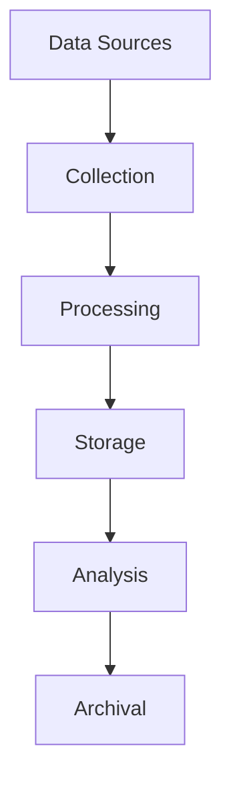

# Data Strategy Documentation

## Version Information
- **Document Version**: 1.0.0
- **Last Updated**: April 17, 2024
- **Compatible System Version**: 1.0.0

## Related Documentation
- [Security Documentation](security-documentation.md) - For data protection and encryption
- [Admin Dashboard](admin-dashboard.md) - For data management interface
- [System Architecture](system-architecture.md) - For data flow and storage architecture
- [Shared Components](shared-components.md) - For common data utilities

## Table of Contents
1. [Data Overview](#data-overview)
2. [Data Collection](#data-collection)
3. [Data Processing](#data-processing)
4. [Data Storage](#data-storage)
5. [Data Privacy](#data-privacy)
6. [Data Quality](#data-quality)
7. [Data Governance](#data-governance)
8. [Data Analytics](#data-analytics)

## Data Overview

### Data Types
| Type | Description | Volume | Retention |
|------|-------------|--------|-----------|
| Video Data | Match footage | High | 1 year |
| Model Data | Training datasets | Medium | 2 years |
| Decision Data | AI decisions | Medium | 5 years |
| User Data | Admin/User info | Low | Until deletion |
| Log Data | System logs | High | 6 months |

### Data Flow


## Data Collection

### Collection Pipeline
```python
# Data collection pipeline
class DataCollector:
    def collect_data(self, source: str) -> Dict:
        return {
            'video_data': self.collect_video_data(source),
            'sensor_data': self.collect_sensor_data(source),
            'metadata': self.collect_metadata(source)
        }

    def collect_video_data(self, source: str) -> Dict:
        return {
            'frames': self.extract_frames(source),
            'timestamps': self.extract_timestamps(source),
            'quality_metrics': self.assess_quality(source)
        }
```

### Data Validation
For validation implementation, see [Shared Components - Data Validator](#data-validator)

## Data Processing

### Processing Pipeline
```python
# Data processing pipeline
class DataProcessor:
    def process_data(self, data: Dict) -> Dict:
        return {
            'processed_video': self.process_video(data['video_data']),
            'processed_sensor': self.process_sensor(data['sensor_data']),
            'processed_metadata': self.process_metadata(data['metadata'])
        }

    def process_video(self, video_data: Dict) -> Dict:
        return {
            'frames': self.normalize_frames(video_data['frames']),
            'features': self.extract_features(video_data['frames']),
            'annotations': self.generate_annotations(video_data['frames'])
        }
```

### Feature Extraction
```python
# Feature extraction
class FeatureExtractor:
    def extract_features(self, data: Dict) -> Dict:
        return {
            'pose_features': self.extract_pose_features(data['frames']),
            'ball_features': self.extract_ball_features(data['frames']),
            'context_features': self.extract_context_features(data['frames'])
        }

    def extract_pose_features(self, frames: np.ndarray) -> np.ndarray:
        return self.pose_model.predict(frames)
```

## Data Storage

### Storage Architecture
```python
# Storage management
class StorageManager:
    def store_data(self, data: Dict) -> str:
        storage_id = self.generate_storage_id()
        self.db.store_metadata(storage_id, data['metadata'])
        self.object_store.store_video(storage_id, data['video_data'])
        self.cache.store_features(storage_id, data['features'])
        return storage_id

    def retrieve_data(self, storage_id: str) -> Dict:
        return {
            'metadata': self.db.get_metadata(storage_id),
            'video_data': self.object_store.get_video(storage_id),
            'features': self.cache.get_features(storage_id)
        }
```

For caching implementation, see [Shared Components - Cache Manager](#cache-manager)

### Data Organization
```python
# Data organization
class DataOrganizer:
    def organize_data(self, data: Dict) -> Dict:
        return {
            'by_match': self.organize_by_match(data),
            'by_date': self.organize_by_date(data),
            'by_type': self.organize_by_type(data)
        }

    def organize_by_match(self, data: Dict) -> Dict:
        return self.db.group_by_match(data)
```

## Data Privacy

### Privacy Controls
```python
# Privacy controls
class PrivacyManager:
    def apply_privacy_controls(self, data: Dict) -> Dict:
        return {
            'anonymized_data': self.anonymize_data(data),
            'encrypted_data': self.encrypt_data(data),
            'access_controls': self.set_access_controls(data)
        }

    def anonymize_data(self, data: Dict) -> Dict:
        return self.anonymizer.process(data)
```

### Compliance
```python
# Compliance management
class ComplianceManager:
    def check_compliance(self, data: Dict) -> bool:
        return (
            self.check_gdpr_compliance(data) and
            self.check_ccpa_compliance(data) and
            self.check_local_regulations(data)
        )

    def check_gdpr_compliance(self, data: Dict) -> bool:
        return self.gdpr_validator.validate(data)
```

## Data Quality

### Quality Assurance
```python
# Quality assurance
class QualityManager:
    def ensure_quality(self, data: Dict) -> Dict:
        return {
            'quality_metrics': self.calculate_quality_metrics(data),
            'validation_results': self.validate_data_quality(data),
            'cleaning_results': self.clean_data(data)
        }

    def calculate_quality_metrics(self, data: Dict) -> Dict:
        return {
            'completeness': self.calculate_completeness(data),
            'accuracy': self.calculate_accuracy(data),
            'consistency': self.calculate_consistency(data)
        }
```

### Data Cleaning
```python
# Data cleaning
class DataCleaner:
    def clean_data(self, data: Dict) -> Dict:
        return {
            'cleaned_video': self.clean_video_data(data['video_data']),
            'cleaned_sensor': self.clean_sensor_data(data['sensor_data']),
            'cleaned_metadata': self.clean_metadata(data['metadata'])
        }

    def clean_video_data(self, video_data: Dict) -> Dict:
        return self.cleaner.process(video_data)
```

## Data Governance

### Governance Framework
```python
# Governance framework
class GovernanceManager:
    def manage_governance(self) -> Dict:
        return {
            'policies': self.define_policies(),
            'roles': self.define_roles(),
            'processes': self.define_processes()
        }

    def define_policies(self) -> Dict:
        return self.policy_manager.get_policies()
```

### Data Lifecycle
```python
# Data lifecycle management
class LifecycleManager:
    def manage_lifecycle(self, data: Dict) -> None:
        self.archive_old_data(data)
        self.delete_expired_data(data)
        self.update_retention_policies(data)

    def archive_old_data(self, data: Dict) -> None:
        self.archive_manager.archive(data)
```

## Data Analytics

### Analytics Pipeline
```python
# Analytics pipeline
class AnalyticsManager:
    def analyze_data(self, data: Dict) -> Dict:
        return {
            'descriptive_stats': self.calculate_descriptive_stats(data),
            'performance_metrics': self.calculate_performance_metrics(data),
            'trends': self.identify_trends(data)
        }

    def calculate_descriptive_stats(self, data: Dict) -> Dict:
        return self.statistics.calculate(data)
```

For metrics collection, see [Shared Components - Metrics Collector](#metrics-collector)

### Reporting
```python
# Reporting
class ReportGenerator:
    def generate_reports(self, analytics: Dict) -> Dict:
        return {
            'daily_report': self.generate_daily_report(analytics),
            'weekly_report': self.generate_weekly_report(analytics),
            'monthly_report': self.generate_monthly_report(analytics)
        }

    def generate_daily_report(self, analytics: Dict) -> str:
        return self.report_builder.build(analytics, 'daily')
```

## Best Practices

### Development
1. Follow data standards
2. Implement validation
3. Document processes
4. Test thoroughly
5. Monitor quality

### Deployment
1. Secure storage
2. Regular backups
3. Access control
4. Monitoring
5. Compliance checks

### Maintenance
1. Regular audits
2. Quality checks
3. Policy updates
4. Documentation
5. Training

## Support
For data strategy-related issues:
- Email: data@raasid.com
- Documentation: https://raasid.com/docs/data
- GitHub Issues: https://github.com/vseel5/raasid-project/issues

---

*Last updated: April 17, 2024*

For security implementation details, see [Security Documentation - Data Protection](#data-protection)

For compliance and audit logging, refer to [Security Documentation - Compliance](#compliance)

For secure storage implementation, see [Security Documentation - Secure Storage](#secure-storage)

For monitoring and metrics, see [Admin Dashboard - System Monitoring](#system-monitoring)