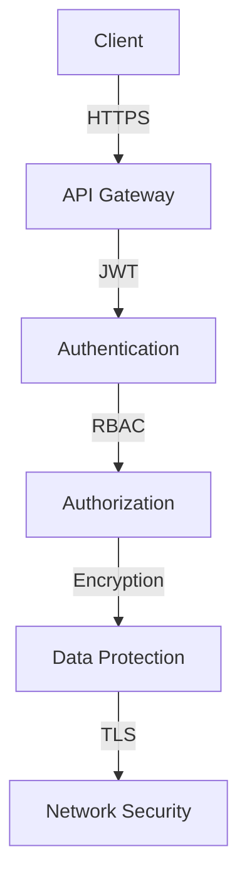

# Security Documentation

## Version Information
- **Document Version**: 1.0.0
- **Last Updated**: April 17, 2024
- **Compatible System Version**: 1.0.0

## Related Documentation
- [Admin Dashboard](admin-dashboard.md) - For security settings and user management
- [Data Strategy](data-strategy.md) - For data protection and privacy controls
- [System Architecture](system-architecture.md) - For security architecture and infrastructure
- [Shared Components](shared-components.md) - For common security utilities

## Table of Contents
1. [Security Overview](#security-overview)
2. [Authentication](#authentication)
3. [Authorization](#authorization)
4. [Data Protection](#data-protection)
5. [Network Security](#network-security)
6. [API Security](#api-security)
7. [Model Security](#model-security)
8. [Compliance](#compliance)

## Security Overview

### Security Architecture


### Security Layers
| Layer | Components | Protection |
|-------|------------|------------|
| Application | API, Models | Authentication, Authorization |
| Data | Storage, Cache | Encryption, Access Control |
| Network | Firewall, VPN | Traffic Control, Isolation |
| Infrastructure | Servers, Containers | Hardening, Patching |

## Authentication

### JWT Implementation
```python
# JWT authentication
class JWTAuth:
    def generate_token(self, user: User) -> str:
        return jwt.encode({
            'user_id': user.id,
            'role': user.role,
            'exp': datetime.now() + timedelta(hours=1)
        }, SECRET_KEY, algorithm='HS256')

    def validate_token(self, token: str) -> Dict:
        try:
            return jwt.decode(token, SECRET_KEY, algorithms=['HS256'])
        except jwt.InvalidTokenError:
            raise SecurityError("Invalid token")
```

### Multi-Factor Authentication
```python
# MFA implementation
class MFA:
    def setup_mfa(self, user: User) -> Dict:
        return {
            'secret': self.generate_secret(),
            'qr_code': self.generate_qr_code(),
            'backup_codes': self.generate_backup_codes()
        }

    def verify_mfa(self, user: User, code: str) -> bool:
        return self.verify_totp(user.mfa_secret, code)
```

For token management implementation, see [Shared Components - Token Manager](#token-manager)

## Authorization

### Role-Based Access Control
```python
# RBAC implementation
class RBAC:
    def check_permission(self, user: User, resource: str, action: str) -> bool:
        role = self.get_role(user.role)
        return self.has_permission(role, resource, action)

    def get_role(self, role_name: str) -> Role:
        return self.db.get_role(role_name)
```

### Permission Matrix
```python
# Permission management
class PermissionManager:
    def define_permissions(self) -> Dict:
        return {
            'admin': {
                'users': ['create', 'read', 'update', 'delete'],
                'models': ['create', 'read', 'update', 'delete'],
                'system': ['configure', 'monitor']
            },
            'operator': {
                'users': ['read'],
                'models': ['read', 'update'],
                'system': ['monitor']
            }
        }
```

For access control implementation, see [Shared Components - Access Control](#access-control)

## Data Protection

### Encryption
```python
# Data encryption
class DataEncryptor:
    def encrypt_data(self, data: Dict) -> bytes:
        return self.encryptor.encrypt(
            json.dumps(data).encode(),
            self.get_key()
        )

    def decrypt_data(self, encrypted: bytes) -> Dict:
        return json.loads(
            self.encryptor.decrypt(encrypted, self.get_key())
        )
```

### Secure Storage
```python
# Secure storage
class SecureStorage:
    def store_sensitive_data(self, data: Dict) -> str:
        encrypted = self.encryptor.encrypt_data(data)
        storage_id = self.generate_id()
        self.db.store_encrypted(storage_id, encrypted)
        return storage_id

    def retrieve_sensitive_data(self, storage_id: str) -> Dict:
        encrypted = self.db.get_encrypted(storage_id)
        return self.encryptor.decrypt_data(encrypted)
```

For data validation and sanitization, see [Shared Components - Data Validator](#data-validator)

## Network Security

### Firewall Rules
```python
# Firewall configuration
class FirewallManager:
    def configure_rules(self) -> List[Dict]:
        return [
            {
                'source': '0.0.0.0/0',
                'destination': 'api.raasid.com',
                'port': 443,
                'protocol': 'tcp',
                'action': 'allow'
            },
            {
                'source': '0.0.0.0/0',
                'destination': '*',
                'port': '*',
                'protocol': '*',
                'action': 'deny'
            }
        ]
```

### SSL/TLS Configuration
```python
# SSL/TLS management
class SSLManager:
    def configure_ssl(self) -> Dict:
        return {
            'certificate': self.get_certificate(),
            'private_key': self.get_private_key(),
            'cipher_suites': self.get_cipher_suites(),
            'protocols': ['TLSv1.2', 'TLSv1.3']
        }
```

## API Security

### Rate Limiting
```python
# Rate limiting
class RateLimiter:
    def check_rate_limit(self, client_id: str) -> bool:
        current = self.get_current_requests(client_id)
        limit = self.get_rate_limit(client_id)
        return current < limit

    def get_rate_limit(self, client_id: str) -> int:
        return self.db.get_client_limit(client_id)
```

### Input Validation
```python
# Input validation
class InputValidator:
    def validate_input(self, data: Dict) -> bool:
        return (
            self.validate_schema(data) and
            self.sanitize_input(data) and
            self.check_bounds(data)
        )

    def sanitize_input(self, data: Dict) -> Dict:
        return {
            k: self.sanitize_value(v)
            for k, v in data.items()
        }
```

## Model Security

### Model Protection
```python
# Model protection
class ModelProtector:
    def protect_model(self, model: torch.nn.Module) -> Dict:
        return {
            'encrypted_weights': self.encrypt_weights(model),
            'signature': self.sign_model(model),
            'access_control': self.set_access_control(model)
        }

    def encrypt_weights(self, model: torch.nn.Module) -> bytes:
        return self.encryptor.encrypt(model.state_dict())
```

### Access Control
```python
# Model access control
class ModelAccessControl:
    def check_model_access(self, user: User, model: str) -> bool:
        return (
            self.check_license(user) and
            self.check_permissions(user, model) and
            self.validate_request(user, model)
        )

    def check_license(self, user: User) -> bool:
        return self.license_manager.validate(user.license)
```

## Compliance

### GDPR Compliance
```python
# GDPR compliance
class GDPRCompliance:
    def ensure_compliance(self, data: Dict) -> bool:
        return (
            self.check_data_minimization(data) and
            self.check_purpose_limitation(data) and
            self.check_storage_limitation(data) and
            self.check_rights_provision(data)
        )

    def check_data_minimization(self, data: Dict) -> bool:
        return self.validator.validate_minimization(data)
```

### Audit Logging
```python
# Audit logging
class AuditLogger:
    def log_security_event(self, event: Dict) -> None:
        self.db.log_event({
            'timestamp': datetime.now(),
            'event_type': event['type'],
            'user_id': event['user_id'],
            'details': event['details'],
            'ip_address': event['ip']
        })

    def get_audit_logs(self, filters: Dict) -> List[Dict]:
        return self.db.get_audit_logs(filters)
```

## Best Practices

### Development
1. Follow security standards
2. Implement secure coding
3. Regular security testing
4. Document security measures
5. Review code regularly

### Deployment
1. Secure configuration
2. Regular updates
3. Monitoring setup
4. Access control
5. Backup strategy

### Maintenance
1. Security patches
2. Regular audits
3. Policy updates
4. Training
5. Documentation

## Support
For security-related issues:
- Email: security@raasid.com
- Documentation: https://raasid.com/docs/security
- GitHub Issues: https://github.com/vseel5/raasid-project/issues

---

*Last updated: April 17, 2024*
