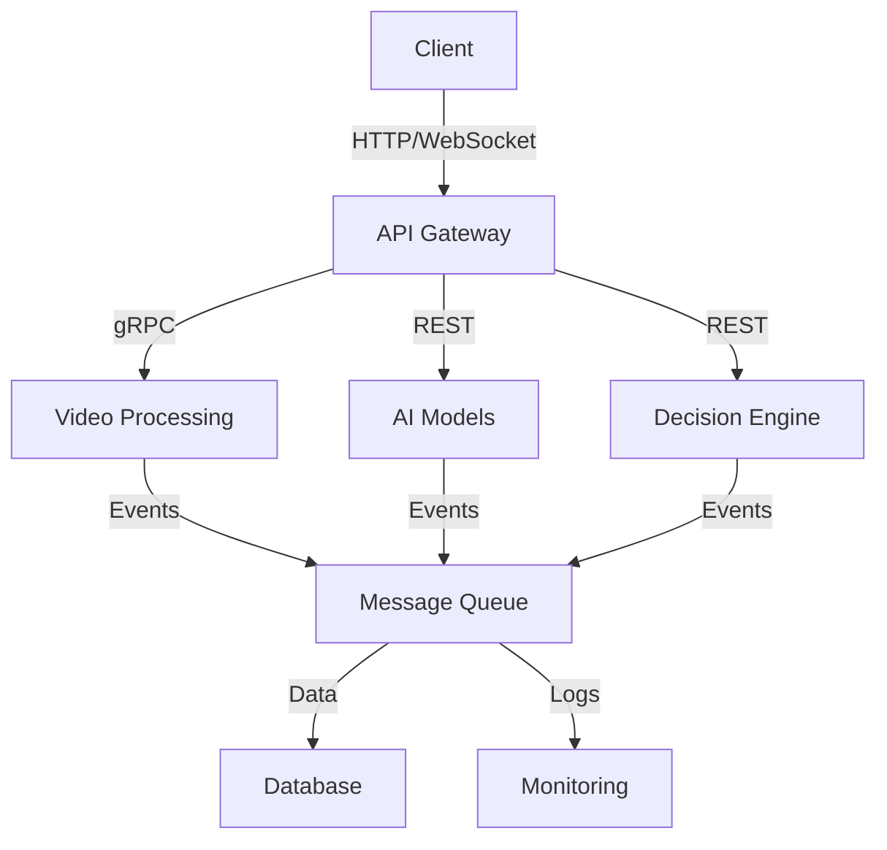
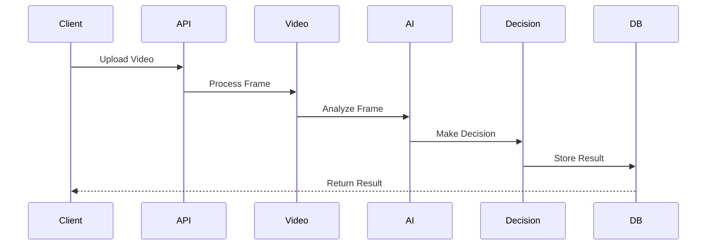

# System Architecture

## Version Information
- **Document Version**: 1.0.0
- **Last Updated**: April 17, 2024
- **Compatible System Version**: 1.0.0

## Table of Contents
1. [Architecture Overview](#architecture-overview)
2. [Core Components](#core-components)
3. [Data Flow](#data-flow)
4. [Technical Stack](#technical-stack)
5. [Deployment Architecture](#deployment-architecture)
6. [Security Architecture](#security-architecture)
7. [Scalability](#scalability)
8. [Monitoring](#monitoring)

## Architecture Overview

### System Diagram


### Component Interaction


## Core Components

### Video Processing Pipeline
```python
# Video processing pipeline
class VideoProcessor:
    def __init__(self):
        self.frame_extractor = FrameExtractor()
        self.feature_detector = FeatureDetector()
        self.analyzer = FrameAnalyzer()

    def process_video(self, video_path: str) -> List[Dict]:
        frames = self.frame_extractor.extract_frames(video_path)
        features = self.feature_detector.detect_features(frames)
        analysis = self.analyzer.analyze_frames(features)
        return analysis
```

### AI Models
```python
# AI model manager
class ModelManager:
    def __init__(self):
        self.context_model = ContextAnalysisModel()
        self.pose_model = PoseEstimationModel()
        self.ball_model = BallDetectionModel()

    def analyze_frame(self, frame: np.ndarray) -> Dict:
        context = self.context_model.analyze(frame)
        pose = self.pose_model.estimate(frame)
        ball = self.ball_model.detect(frame)
        return {
            'context': context,
            'pose': pose,
            'ball': ball
        }
```

### Decision Engine
```python
# Decision engine
class DecisionEngine:
    def __init__(self):
        self.rules = RuleEngine()
        self.confidence = ConfidenceCalculator()
        self.history = DecisionHistory()

    def make_decision(self, analysis: Dict) -> Dict:
        rule_result = self.rules.evaluate(analysis)
        confidence = self.confidence.calculate(analysis)
        decision = self.combine_results(rule_result, confidence)
        self.history.store(decision)
        return decision
```

## Data Flow

### Request Flow
```python
# Request handler
class RequestHandler:
    def handle_request(self, request: Dict) -> Dict:
        # Validate request
        self.validator.validate(request)
        
        # Process video
        video_data = self.video_processor.process(request['video'])
        
        # Analyze frames
        analysis = self.model_manager.analyze(video_data)
        
        # Make decision
        decision = self.decision_engine.make_decision(analysis)
        
        # Store results
        self.database.store(decision)
        
        return decision
```

### Event Flow
```python
# Event handler
class EventHandler:
    def handle_event(self, event: Dict) -> None:
        # Publish event
        self.message_queue.publish(event)
        
        # Process event
        if event['type'] == 'frame_processed':
            self.process_frame(event['data'])
        elif event['type'] == 'decision_made':
            self.handle_decision(event['data'])
```

## Technical Stack

### Backend Stack
```yaml
# Backend stack
backend:
  framework: FastAPI
  language: Python 3.8+
  database: PostgreSQL
  cache: Redis
  message_queue: RabbitMQ
  monitoring: Prometheus + Grafana
```

### AI Stack
```yaml
# AI stack
ai:
  framework: PyTorch
  models:
    - Context Analysis (CNN)
    - Pose Estimation (ResNet50)
    - Ball Detection (YOLOv5)
  training: PyTorch Lightning
  optimization: ONNX Runtime
```

### Frontend Stack
```yaml
# Frontend stack
frontend:
  framework: Streamlit
  visualization: Plotly
  state_management: Redux
  styling: Tailwind CSS
```

## Deployment Architecture

### Container Architecture
```yaml
# docker-compose.yml
version: '3.8'

services:
  api:
    image: raasid-api
    ports:
      - "8000:8000"
    depends_on:
      - db
      - redis
      - rabbitmq

  video_processor:
    image: raasid-video
    deploy:
      resources:
        reservations:
          devices:
            - driver: nvidia
              count: 1

  ai_models:
    image: raasid-models
    deploy:
      resources:
        reservations:
          devices:
            - driver: nvidia
              count: 1

  db:
    image: postgres:13
    environment:
      POSTGRES_DB: raasid
      POSTGRES_USER: user
      POSTGRES_PASSWORD: password

  redis:
    image: redis:6

  rabbitmq:
    image: rabbitmq:3-management
```

### Kubernetes Architecture
```yaml
# kubernetes deployment
apiVersion: apps/v1
kind: Deployment
metadata:
  name: raasid-api
spec:
  replicas: 3
  selector:
    matchLabels:
      app: raasid-api
  template:
    metadata:
      labels:
        app: raasid-api
    spec:
      containers:
      - name: api
        image: raasid-api
        ports:
        - containerPort: 8000
        resources:
          limits:
            cpu: "1"
            memory: "1Gi"
```

## Security Architecture

### Authentication
```python
# Authentication manager
class AuthManager:
    def authenticate(self, request: Request) -> bool:
        token = self.extract_token(request)
        return self.validate_token(token)

    def authorize(self, user: User, resource: str) -> bool:
        return self.check_permissions(user, resource)
```

### Data Protection
```python
# Data protection
class DataProtector:
    def encrypt_data(self, data: Dict) -> bytes:
        return self.encryptor.encrypt(json.dumps(data))

    def decrypt_data(self, encrypted: bytes) -> Dict:
        return json.loads(self.encryptor.decrypt(encrypted))
```

## Scalability

### Horizontal Scaling
```python
# Scaling manager
class ScalingManager:
    def scale_service(self, service: str, replicas: int) -> None:
        if service == 'api':
            self.scale_api(replicas)
        elif service == 'video':
            self.scale_video(replicas)
        elif service == 'models':
            self.scale_models(replicas)
```

### Load Balancing
```python
# Load balancer
class LoadBalancer:
    def distribute_load(self, request: Request) -> str:
        service = self.select_service(request)
        instance = self.select_instance(service)
        return instance
```

## Monitoring

### Metrics Collection
```python
# Metrics collector
class MetricsCollector:
    def collect_metrics(self) -> Dict:
        return {
            'api_metrics': self.collect_api_metrics(),
            'model_metrics': self.collect_model_metrics(),
            'system_metrics': self.collect_system_metrics()
        }
```

### Alerting
```python
# Alert manager
class AlertManager:
    def check_alerts(self, metrics: Dict) -> List[str]:
        alerts = []
        if metrics['cpu_usage'] > 90:
            alerts.append('High CPU usage')
        if metrics['memory_usage'] > 80:
            alerts.append('High memory usage')
        return alerts
```

## Best Practices

### Development
1. Follow SOLID principles
2. Write clean code
3. Document thoroughly
4. Test extensively
5. Review regularly

### Deployment
1. Use containers
2. Implement CI/CD
3. Monitor performance
4. Backup regularly
5. Plan for failure

### Maintenance
1. Regular updates
2. Security patches
3. Performance tuning
4. Capacity planning
5. Documentation updates

## Support
For architecture-related issues:
- Email: architecture@raasid.com
- Documentation: https://raasid.com/docs/architecture
- GitHub Issues: https://github.com/vseel5/raasid-project/issues

---

*Last updated: April 17, 2024*