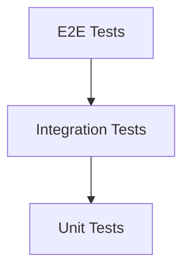

# Test Automation Guide

## Version Information
- **Document Version**: 1.0.0
- **Last Updated**: April 17, 2024
- **Compatible System Version**: 1.0.0

## Table of Contents
1. [Testing Strategy](#testing-strategy)
2. [Unit Testing](#unit-testing)
3. [Integration Testing](#integration-testing)
4. [End-to-End Testing](#end-to-end-testing)
5. [Performance Testing](#performance-testing)
6. [Security Testing](#security-testing)
7. [Test Automation Framework](#test-automation-framework)
8. [CI/CD Integration](#ci-cd-integration)

## Testing Strategy

### Test Pyramid


### Coverage Requirements
| Test Type | Target Coverage | Measurement |
|-----------|-----------------|-------------|
| Unit Tests | > 90% | Line coverage |
| Integration Tests | > 80% | API coverage |
| E2E Tests | > 70% | Feature coverage |

## Unit Testing

### Test Structure
```python
# Example unit test
class TestPoseEstimation(unittest.TestCase):
    def setUp(self):
        self.model = PoseEstimationModel()
        self.test_image = load_test_image()

    def test_pose_detection(self):
        result = self.model.detect_pose(self.test_image)
        self.assertIsNotNone(result)
        self.assertGreater(len(result.keypoints), 0)

    def test_confidence_threshold(self):
        result = self.model.detect_pose(self.test_image, confidence=0.8)
        self.assertGreaterEqual(result.confidence, 0.8)
```

### Mocking
```python
# Mocking example
class TestAPIClient(unittest.TestCase):
    @patch('requests.post')
    def test_api_call(self, mock_post):
        mock_post.return_value.json.return_value = {'status': 'success'}
        client = APIClient()
        result = client.make_request()
        self.assertEqual(result['status'], 'success')
```

## Integration Testing

### API Testing
```python
# API test example
class TestAPIEndpoints(unittest.TestCase):
    def setUp(self):
        self.client = TestClient(app)

    def test_pose_endpoint(self):
        response = self.client.post('/api/v1/pose/estimate', json={
            'image': 'base64_encoded_image',
            'parameters': {'confidence_threshold': 0.7}
        })
        self.assertEqual(response.status_code, 200)
        self.assertIn('pose_data', response.json())
```

### Database Testing
```python
# Database test example
class TestDatabaseOperations(unittest.TestCase):
    def setUp(self):
        self.db = Database()
        self.db.create_test_tables()

    def test_data_insertion(self):
        test_data = {'frame_id': 1, 'pose_data': {}}
        self.db.insert_frame_data(test_data)
        result = self.db.get_frame_data(1)
        self.assertEqual(result['frame_id'], 1)
```

## End-to-End Testing

### Video Processing Test
```python
# E2E test example
class TestVideoProcessing(unittest.TestCase):
    def setUp(self):
        self.processor = VideoProcessor()
        self.test_video = 'test_video.mp4'

    def test_full_pipeline(self):
        results = self.processor.process_video(self.test_video)
        self.assertGreater(len(results), 0)
        self.assertTrue(all(r['status'] == 'success' for r in results))
```

### UI Testing
```python
# UI test example
class TestUserInterface(unittest.TestCase):
    def setUp(self):
        self.driver = webdriver.Chrome()
        self.driver.get('http://localhost:8501')

    def test_video_upload(self):
        upload_button = self.driver.find_element_by_id('upload-button')
        upload_button.send_keys('test_video.mp4')
        self.assertTrue(self.driver.find_element_by_id('processing-status').is_displayed())
```

## Performance Testing

### Load Testing
```python
# Load test example
class TestSystemLoad(unittest.TestCase):
    def test_concurrent_requests(self):
        with ThreadPoolExecutor(max_workers=10) as executor:
            futures = [executor.submit(self.make_request) for _ in range(100)]
            results = [f.result() for f in futures]
            self.assertTrue(all(r.status_code == 200 for r in results))
```

### Stress Testing
```python
# Stress test example
class TestSystemStress(unittest.TestCase):
    def test_high_load(self):
        start_time = time.time()
        while time.time() - start_time < 300:  # 5 minutes
            self.make_request()
            time.sleep(0.1)
        metrics = self.get_system_metrics()
        self.assertLess(metrics['cpu_usage'], 90)
        self.assertLess(metrics['memory_usage'], 80)
```

## Security Testing

### Authentication Testing
```python
# Security test example
class TestAuthentication(unittest.TestCase):
    def test_invalid_api_key(self):
        response = self.client.get('/api/v1/health', headers={
            'Authorization': 'Bearer invalid_key'
        })
        self.assertEqual(response.status_code, 401)

    def test_rate_limiting(self):
        for _ in range(101):
            self.make_request()
        response = self.make_request()
        self.assertEqual(response.status_code, 429)
```

### Data Protection Testing
```python
# Data protection test example
class TestDataProtection(unittest.TestCase):
    def test_encryption(self):
        data = {'sensitive': 'data'}
        encrypted = self.encryptor.encrypt(data)
        decrypted = self.encryptor.decrypt(encrypted)
        self.assertEqual(data, decrypted)
```

## Test Automation Framework

### Configuration
```yaml
# test_config.yaml
test_suites:
  unit:
    pattern: "test_*.py"
    directory: "tests/unit"
  integration:
    pattern: "test_*.py"
    directory: "tests/integration"
  e2e:
    pattern: "test_*.py"
    directory: "tests/e2e"

coverage:
  target: 90
  exclude:
    - "tests/*"
    - "venv/*"

reporting:
  format: "html"
  directory: "test_reports"
```

### Test Runner
```python
# Test runner implementation
class TestRunner:
    def run_tests(self, test_suite: str) -> Dict:
        loader = unittest.TestLoader()
        suite = loader.discover(
            f"tests/{test_suite}",
            pattern="test_*.py"
        )
        runner = unittest.TextTestRunner()
        result = runner.run(suite)
        return self.generate_report(result)
```

## CI/CD Integration

### GitHub Actions
```yaml
# .github/workflows/tests.yaml
name: Tests

on: [push, pull_request]

jobs:
  test:
    runs-on: ubuntu-latest
    steps:
      - uses: actions/checkout@v2
      - name: Set up Python
        uses: actions/setup-python@v2
        with:
          python-version: '3.8'
      - name: Install dependencies
        run: |
          python -m pip install --upgrade pip
          pip install -r requirements.txt
          pip install pytest pytest-cov
      - name: Run tests
        run: |
          pytest --cov=api tests/
      - name: Upload coverage
        uses: codecov/codecov-action@v2
```

### Test Reports
```python
# Report generator
class TestReportGenerator:
    def generate_report(self, results: Dict) -> str:
        return f"""
        Test Results
        ------------
        Total Tests: {results['total']}
        Passed: {results['passed']}
        Failed: {results['failed']}
        Skipped: {results['skipped']}
        Coverage: {results['coverage']}%
        """
```

## Best Practices

### Development
1. Write tests before code
2. Keep tests independent
3. Use meaningful test names
4. Follow DRY principle
5. Maintain test documentation

### Maintenance
1. Regular test updates
2. Monitor test coverage
3. Review test results
4. Update test data
5. Document changes

### CI/CD
1. Automate test execution
2. Monitor build status
3. Track coverage trends
4. Review test reports
5. Maintain test environment

## Support
For testing-related issues:
- Email: testing@raasid.com
- Documentation: https://raasid.com/docs/testing
- GitHub Issues: https://github.com/vseel5/raasid-project/issues

---

*Last updated: April 17, 2024*
