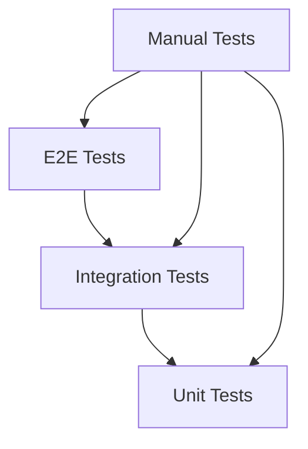

# Testing Strategy

## Version Information
- **Document Version**: 1.0.0
- **Last Updated**: April 17, 2024
- **Compatible System Version**: 1.0.0

## Table of Contents
1. [Testing Approach](#testing-approach)
2. [Test Levels](#test-levels)
3. [Test Types](#test-types)
4. [Test Environment](#test-environment)
5. [Test Data Management](#test-data-management)
6. [Test Automation](#test-automation)
7. [Quality Gates](#quality-gates)
8. [Best Practices](#best-practices)

## Testing Approach

### Testing Pyramid


### Test Coverage Goals
| Test Type | Coverage Target | Measurement |
|-----------|-----------------|-------------|
| Unit Tests | > 90% | Line coverage |
| Integration Tests | > 80% | API coverage |
| E2E Tests | > 70% | Feature coverage |
| Manual Tests | 100% | Critical paths |

## Test Levels

### Unit Testing
```python
# Unit test example
class TestPoseEstimation(unittest.TestCase):
    def setUp(self):
        self.model = PoseEstimationModel()
        self.test_image = load_test_image()

    def test_pose_detection(self):
        result = self.model.detect_pose(self.test_image)
        self.assertIsNotNone(result)
        self.assertGreater(len(result.keypoints), 0)

    def test_confidence_threshold(self):
        result = self.model.detect_pose(self.test_image, confidence=0.8)
        self.assertGreaterEqual(result.confidence, 0.8)
```

### Integration Testing
```python
# Integration test example
class TestAPIIntegration(unittest.TestCase):
    def setUp(self):
        self.client = TestClient(app)

    def test_full_pipeline(self):
        # Test pose estimation
        pose_response = self.client.post('/api/v1/pose/estimate', json={
            'image': 'base64_encoded_image',
            'parameters': {'confidence_threshold': 0.7}
        })
        self.assertEqual(pose_response.status_code, 200)

        # Test ball detection
        ball_response = self.client.post('/api/v1/ball/detect', json={
            'image': 'base64_encoded_image',
            'parameters': {'confidence_threshold': 0.8}
        })
        self.assertEqual(ball_response.status_code, 200)

        # Test decision making
        decision_response = self.client.post('/api/v1/decision/make', json={
            'pose_data': pose_response.json(),
            'ball_data': ball_response.json()
        })
        self.assertEqual(decision_response.status_code, 200)
```

### End-to-End Testing
```python
# E2E test example
class TestSystemE2E(unittest.TestCase):
    def setUp(self):
        self.driver = webdriver.Chrome()
        self.driver.get('http://localhost:8501')

    def test_video_analysis_flow(self):
        # Upload video
        upload_button = self.driver.find_element_by_id('upload-button')
        upload_button.send_keys('test_video.mp4')

        # Start analysis
        start_button = self.driver.find_element_by_id('start-analysis')
        start_button.click()

        # Wait for results
        WebDriverWait(self.driver, 30).until(
            EC.presence_of_element_located((By.ID, 'results'))
        )

        # Verify results
        results = self.driver.find_element_by_id('results')
        self.assertIn('Handball Detected', results.text)
```

## Test Types

### Functional Testing
```python
# Functional test example
class TestFunctional(unittest.TestCase):
    def test_pose_estimation_functionality(self):
        model = PoseEstimationModel()
        result = model.detect_pose(test_image)
        self.assertTrue(self.verify_pose_estimation(result))

    def test_ball_detection_functionality(self):
        model = BallDetectionModel()
        result = model.detect_ball(test_image)
        self.assertTrue(self.verify_ball_detection(result))
```

### Performance Testing
```python
# Performance test example
class TestPerformance(unittest.TestCase):
    def test_api_response_time(self):
        start_time = time.time()
        response = self.client.get('/api/v1/health')
        end_time = time.time()
        self.assertLess(end_time - start_time, 0.1)  # 100ms

    def test_model_inference_time(self):
        model = PoseEstimationModel()
        start_time = time.time()
        result = model.detect_pose(test_image)
        end_time = time.time()
        self.assertLess(end_time - start_time, 0.05)  # 50ms
```

### Security Testing
```python
# Security test example
class TestSecurity(unittest.TestCase):
    def test_authentication(self):
        response = self.client.get('/api/v1/health', headers={
            'Authorization': 'Bearer invalid_key'
        })
        self.assertEqual(response.status_code, 401)

    def test_rate_limiting(self):
        for _ in range(101):
            self.make_request()
        response = self.make_request()
        self.assertEqual(response.status_code, 429)
```

## Test Environment

### Environment Configuration
```yaml
# test_environment.yaml
environments:
  development:
    api_url: http://localhost:8000
    database: raasid_dev
    models: local_models
    
  staging:
    api_url: https://staging.raasid.com
    database: raasid_staging
    models: staging_models
    
  production:
    api_url: https://api.raasid.com
    database: raasid_prod
    models: production_models
```

### Test Infrastructure
```python
# Test infrastructure
class TestInfrastructure:
    def setUp(self):
        self.setup_database()
        self.setup_models()
        self.setup_api()

    def setup_database(self):
        self.db = Database()
        self.db.create_test_tables()
        self.db.load_test_data()

    def setup_models(self):
        self.models = ModelManager()
        self.models.load_test_models()

    def setup_api(self):
        self.api = APIClient()
        self.api.authenticate()
```

## Test Data Management

### Test Data Generation
```python
# Test data generation
class TestDataGenerator:
    def generate_test_data(self) -> Dict:
        return {
            'videos': self.generate_videos(),
            'annotations': self.generate_annotations(),
            'metadata': self.generate_metadata()
        }

    def generate_videos(self) -> List[str]:
        return [self.create_test_video() for _ in range(10)]

    def generate_annotations(self) -> List[Dict]:
        return [self.create_annotation() for _ in range(100)]
```

### Data Validation
```python
# Data validation
class TestDataValidator:
    def validate_test_data(self, data: Dict) -> bool:
        return (
            self.validate_videos(data['videos']) and
            self.validate_annotations(data['annotations']) and
            self.validate_metadata(data['metadata'])
        )

    def validate_videos(self, videos: List[str]) -> bool:
        return all(self.is_valid_video(video) for video in videos)
```

## Test Automation

### CI/CD Integration
```yaml
# GitHub Actions workflow
name: Tests

on: [push, pull_request]

jobs:
  test:
    runs-on: ubuntu-latest
    steps:
      - uses: actions/checkout@v2
      - name: Set up Python
        uses: actions/setup-python@v2
        with:
          python-version: '3.8'
      - name: Install dependencies
        run: |
          pip install -r requirements.txt
          pip install pytest pytest-cov
      - name: Run tests
        run: |
          pytest --cov=api tests/
      - name: Upload coverage
        uses: codecov/codecov-action@v2
```

### Test Reporting
```python
# Test reporting
class TestReporter:
    def generate_report(self, results: Dict) -> str:
        return f"""
        Test Results
        ------------
        Total Tests: {results['total']}
        Passed: {results['passed']}
        Failed: {results['failed']}
        Skipped: {results['skipped']}
        Coverage: {results['coverage']}%
        Duration: {results['duration']}s
        """
```

## Quality Gates

### Code Quality
```yaml
# Quality gates
quality_gates:
  code_coverage:
    minimum: 90
    target: 95
    
  test_success:
    minimum: 95
    target: 100
    
  performance:
    api_latency: 100ms
    model_inference: 50ms
    
  security:
    vulnerabilities: 0
    dependencies: up_to_date
```

### Release Criteria
```python
# Release criteria
class ReleaseValidator:
    def validate_release(self) -> bool:
        return (
            self.check_code_coverage() and
            self.check_test_results() and
            self.check_performance() and
            self.check_security()
        )

    def check_code_coverage(self) -> bool:
        coverage = self.get_code_coverage()
        return coverage >= self.quality_gates['code_coverage']['minimum']
```

## Best Practices

### Development
1. Write tests first
2. Keep tests independent
3. Use meaningful names
4. Follow DRY principle
5. Document tests

### Maintenance
1. Regular updates
2. Monitor coverage
3. Review results
4. Update data
5. Document changes

### CI/CD
1. Automate testing
2. Monitor builds
3. Track metrics
4. Review reports
5. Maintain environment

## Support
For testing-related issues:
- Email: testing@raasid.com
- Documentation: https://raasid.com/docs/testing
- GitHub Issues: https://github.com/vseel5/raasid-project/issues

---

*Last updated: April 17, 2024*


